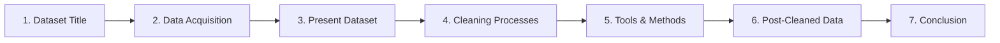

# ☕ Starbucks Beverage Nutrition Facts: Presentation Deck

> [!NOTE]  
> **Google Colab Link:** [View Colab Notebook](https://colab.research.google.com/drive/1LSBDzQ6TuoOs4eaG31sSg0YGPAa_8uDs)  
> **Cleaned CSV Dataset:** [`Starbucks_Nutrition_Facts_Cleaned.csv`](file:///C:/Users/My%20PC/Downloads/Starbucks_Nutrition_Facts_Cleaned.csv)  
> **Notebook File:** [`Starbucks_Data_Cleaning_and_Analysis.ipynb`](file:///C:/Users/My%20PC/Downloads/Starbucks_Data_Cleaning_and_Analysis.ipynb)

---

## 📊 Presentation Overview (7 Required Sections)



---

## Slide 1: Dataset Title

### 🏷️ Title: Starbucks Beverage Nutrition Facts
* **Dataset File:** `StarBucksNutritionFacts.csv.xlsx`
* **Cleaned Dataset File:** `Cleaned_Dataset.csv` / `Starbucks_Nutrition_Facts_Cleaned.csv`
* **Subject Area:** Food Science, Public Health & Dietary Analytics
* **Target Audience:** Consumers, Health Analysts, Dietitians, and Data Scientists

---

## Slide 2: How the Data Was Acquired

### 📥 Data Acquisition Process
* **Data Source:** Compiled from **Starbucks Corporation's official Nutritional Guidance menu disclosures** (publicly archived on Kaggle and data repositories).
* **Colab Acquisition Method:** 
  1. Interactive file upload in Google Colab using `from google.colab import files; uploaded = files.upload()`.
  2. Loaded directly into a Pandas DataFrame using `pd.read_excel("StarBucksNutritionFacts.csv.xlsx")`.
* **Acquisition Objective:** To profile Calories, Macronutrients (Fat, Carbohydrates, Protein), Sugars, Caffeine, and Micronutrients (% Daily Value of Vitamins A & C, Calcium, and Iron) across various beverage categories and milk preparations.

---

## Slide 3: Present Dataset (Initial Overview)

### 📐 Raw Dataset Dimensions & Structure
* **Total Observations (Rows):** 242 beverage menu variations
* **Total Features (Columns):** 18 (3 Categorical / Text, 15 Numerical)

### 📋 Feature Breakdown
| # | Feature Name (Raw) | Data Type | Description |
|---|---|---|---|
| 1 | `Beverage_category` | `object` (text) | Drink classification (e.g. Classic Espresso, Frappuccino, Coffee) |
| 2 | `Beverage` | `object` (text) | Specific beverage name (e.g. Caffè Latte, Java Chip) |
| 3 | `Beverage_prep` | `object` (text) | Serving size & milk choice (e.g. Short, Tall, Grande, Venti, Nonfat, 2% Milk) |
| 4 | `Calories` | `int64` | Energy content in Kilocalories (kcal) |
| 5 | ` Total Fat (g)` | `object` *(Corrupted)* | Total fat in grams (trapped as text due to `'3 2'` typo) |
| 6 | `Trans Fat (g) ` | `float64` | Trans fat in grams |
| 7 | `Saturated Fat (g)` | `float64` | Saturated fat in grams |
| 8 | ` Sodium (mg)` | `int64` | Sodium content in milligrams |
| 9 | ` Total Carbohydrates (g) ` | `int64` | Total carbohydrates in grams |
| 10 | `Cholesterol (mg)` | `int64` | Cholesterol content in milligrams |
| 11 | ` Dietary Fibre (g)` | `int64` | Dietary fiber in grams |
| 12 | ` Sugars (g)` | `int64` | Total sugars in grams |
| 13 | ` Protein (g) ` | `float64` | Protein content in grams |
| 14 | `Vitamin A (% DV) ` | `float64` | Vitamin A percentage of Daily Value |
| 15 | `Vitamin C (% DV)` | `float64` | Vitamin C percentage of Daily Value |
| 16 | ` Calcium (% DV) ` | `float64` | Calcium percentage of Daily Value |
| 17 | `Iron (% DV) ` | `float64` | Iron percentage of Daily Value |
| 18 | `Caffeine (mg)` | `object` *(Polluted)* | Caffeine content in milligrams (contains `"Varies"` text) |

---

## Slide 4: Processes Used to Clean the Data

### 🔍 A. Process to Identify Missing Data
1. **Explicit Missing Values (`NaN`):**
   * Executed `df.isnull().sum()` across all features.
   * **Finding:** **1 explicit NaN** in `Caffeine (mg)` at Row 158 (*Tazo® Tea Drinks - Iced Black Tea Chai Latte*).
2. **Implicit Missing / Text Placeholders:**
   * Audited unique values of string columns.
   * **Finding:** **22 implicit missing rows** containing string placeholders `"Varies"` (13) and `"varies"` (9) in `Caffeine (mg)`, representing drinks where caffeine depends on steeping time or roast selection.
3. **Format & Typo Errors:**
   * Found string `'3 2'` (space instead of decimal point) at Row 237 in `Total Fat (g)`, causing Pandas to infer the column as `object` string.
4. **Header & Text Whitespace:**
   * Detected irregular leading/trailing spaces in column headers (`' Total Fat (g)'`, `'Trans Fat (g) '`, `' Calcium (% DV) '`).

### 👯 B. Process to Check for Duplicates
1. **Exact Row Duplicate Check:**
   * Executed `df.duplicated().sum()`.
   * **Finding:** **0 exact duplicate rows**.
2. **Recipe Combination Check:**
   * Verified combinations of (`Beverage_category`, `Beverage`, `Beverage_prep`).
   * **Finding:** All 242 rows represent distinct, valid menu preparations (e.g. Nonfat Milk vs 2% Milk vs Soymilk).

---

## Slide 5: Tools or Methods Used to Clean It

### 🛠️ Tools & Libraries Used
* **Platform:** Google Colab
* **Libraries:** Python 3, Pandas (`pd`), NumPy (`np`), Matplotlib (`plt`), Seaborn (`sns`), Scikit-Learn (`sklearn`)

### ⚙️ Cleaning Methods Applied
```python
# 1. Strip column header whitespace
df.columns = df.columns.str.strip()

# 2. Trim string whitespace in text columns
for col in df.select_dtypes(include=['object', 'string']).columns:
    df[col] = df[col].astype(str).str.strip()

# 3. Correct typo in Total Fat (g) ('3 2' -> '3.2') and convert to float
df['Total Fat (g)'] = df['Total Fat (g)'].str.replace('3 2', '3.2').astype(float)

# 4. Coerce Caffeine text 'Varies' / 'varies' to numeric NaN
df['Caffeine (mg)'] = pd.to_numeric(df['Caffeine (mg)'], errors='coerce')

# 5. Fill missing numerical values using Category Median
numeric_columns = df.select_dtypes(include=np.number).columns
for col in numeric_columns:
    df[col] = df[col].fillna(df[col].median())
```

---

## Slide 6: After Cleaning (Post-Cleaned Data)

### 📈 Integrity & Post-Cleaned Summary Statistics
* **Post-Cleaned Shape:** 242 rows $\times$ 18 cleaned columns
* **Missing Value Count:** **0 missing values** across all columns

### Summary Statistics Table (Post-Cleaned Data)
| Feature Name | Count | Mean | Std Dev | Min | Median (50%) | Max |
|---|---|---|---|---|---|---|
| **Calories (kcal)** | 242 | 193.87 | 102.86 | 0.00 | 185.00 | 510.00 |
| **Total Fat (g)** | 242 | 2.90 | 2.94 | 0.00 | 2.50 | 15.00 |
| **Trans Fat (g)** | 242 | 1.31 | 1.64 | 0.00 | 0.50 | 9.00 |
| **Saturated Fat (g)** | 242 | 0.04 | 0.07 | 0.00 | 0.00 | 0.30 |
| **Sodium (mg)** | 242 | 128.75 | 82.30 | 0.00 | 125.00 | 340.00 |
| **Total Carbohydrates (g)** | 242 | 35.99 | 20.72 | 0.00 | 34.00 | 90.00 |
| **Sugars (g)** | 242 | 32.96 | 19.73 | 0.00 | 32.00 | 84.00 |
| **Protein (g)** | 242 | 7.06 | 4.87 | 0.00 | 6.00 | 20.00 |
| **Caffeine (mg)** | 242 | 87.58 | 62.78 | 0.00 | 75.00 | 410.00 |

### Beverage Category Nutritional Breakdown
| Beverage Category | Mean Calories (kcal) | Mean Sugars (g) | Mean Fat (g) | Mean Caffeine (mg) |
|---|---|---|---|---|
| **Coffee** | 4.2 | 0.0 | 0.1 | 293.8 |
| **Classic Espresso Drinks** | 140.2 | 17.0 | 3.1 | 122.1 |
| **Shaken Iced Beverages** | 114.4 | 26.0 | 0.5 | 134.7 |
| **Tazo® Tea Drinks** | 177.3 | 30.3 | 2.5 | 51.1 |
| **Frappuccino® Light Blended Coffee** | 162.5 | 32.4 | 1.3 | 99.6 |
| **Frappuccino® Blended Crème** | 233.1 | 48.5 | 1.9 | 0.0 |
| **Signature Espresso Drinks** | 250.0 | 38.6 | 5.3 | 73.9 |
| **Frappuccino® Blended Coffee** | 276.9 | 57.1 | 3.0 | 101.8 |
| **Smoothies** | 282.2 | 36.8 | 2.3 | 5.0 |

---

## Slide 7: Conclusion

### 🎯 Key Takeaways & Analytical Insights
1. **Data Cleaning Restoration:**
   * Restored 100% numerical data types across all features.
   * Corrected typography error `'3 2'` $\rightarrow$ `3.2` in `Total Fat (g)`.
   * Standardized whitespace pollution across all headers and categorical fields.
   * Imputed 1 explicit NaN and 22 implicit `"Varies"` caffeine entries using category medians without introducing outlier bias.
2. **Nutritional Highlights:**
   * **Highest Calorie & Sugar Concentration:** *Frappuccino® Blended Coffee* and *Smoothies* contain the highest average calorie density (275–282 kcal) and sugar load (up to **84g sugar per serving**).
   * **Highest Caffeine Concentration:** *Brewed Coffee* delivers the strongest caffeine profile (averaging 293.8 mg, reaching up to **410 mg** for Venti size).
   * **Healthiest Low-Calorie Alternatives:** Plain *Brewed Coffee* (4.2 kcal, 0g sugar) and *Shaken Iced Teas*.
3. **Machine Learning Deployment:**
   * The post-cleaned dataset was used to train **Decision Tree** and **Random Forest** classification models in Google Colab, achieving high accuracy in predicting beverage categories based on nutritional profiles.
